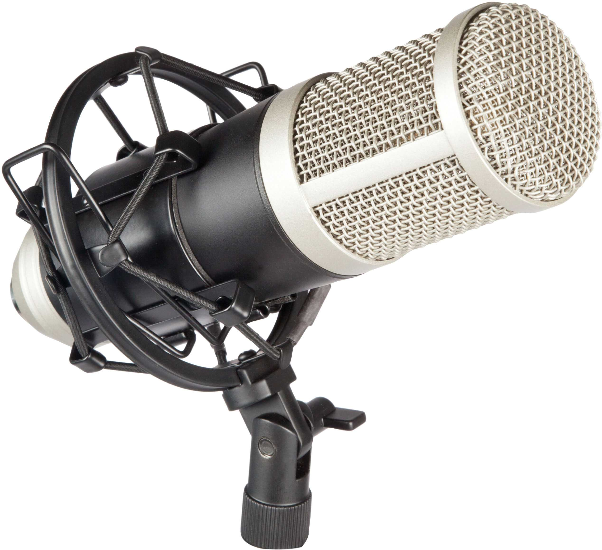
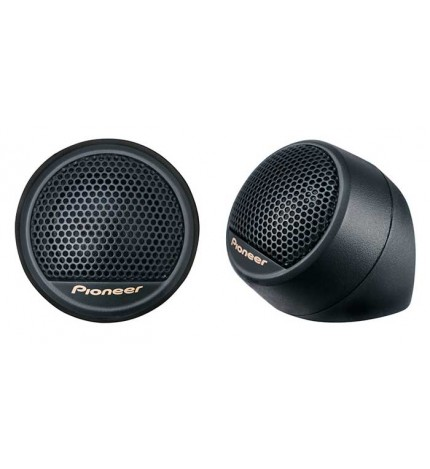

# Tipo de altavoces y micrófonos

## Micrófonos

- **Micrófonos de Condensador**:

    Son sensibles y ofrecen una respuesta de frecuencia amplia.  
    Adecuados para grabaciones en estudios, voces, instrumentos acústicos y situaciones donde se requiere una alta calidad de sonido.

  

- **Micrófonos Dinámicos**:

    Robustos y versátiles.  
    Adecuados para aplicaciones en vivo, grabaciones de batería, amplificadores de guitarra y situaciones de alto volumen.

- **Micrófonos de Cinta**:

    Utilizan una delgada cinta conductor para captar el sonido.  
    Ofrecen un sonido suave y cálido.

## Altavoces

- **Altavoces de Rango Completo**:
  
    Estos altavoces están diseñados para reproducir un rango completo de frecuencias de audio, desde graves hasta agudos.  
    Son comúnmente utilizados en sistemas de altavoces estéreo y algunas configuraciones de audio para el hogar.

- **Woofers**:
  
    Los woofers están especializados en la reproducción de frecuencias bajas o graves.  
    Por lo general, se utilizan junto con otros altavoces para formar sistemas de altavoces más completos y abordar todo el espectro de frecuencias.

- **Tweeters**:
  
    Los tweeters se centran en la reproducción de frecuencias altas o agudas.  
    Se utilizan para proporcionar detalles en la reproducción de sonidos agudos y son comunes en sistemas de altavoces de alta fidelidad.

  
