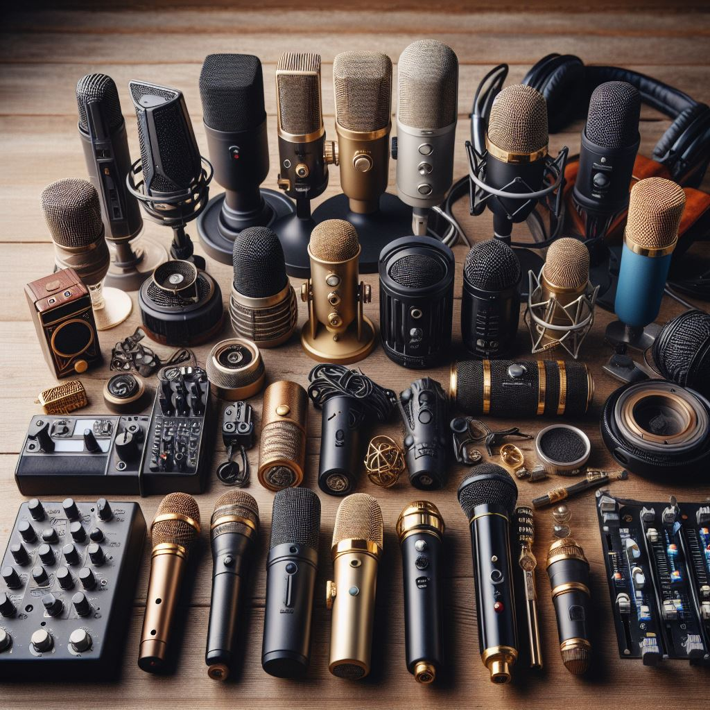

# Factores que influyen en la elección de micrófonos y altavoces

## Micrófonos:

  - **Tipo de micrófono**:

    Hay varios tipos de micrófonos, como condensador, dinámico, de cinta, etc. La elección del tipo de micrófono depende de la aplicación específica. 

  - **Sensibilidad y respuesta de frecuencia**:

    Un micrófono con una sensibilidad y respuesta de frecuencia plana capturará un espectro completo de sonidos de manera más fiel.

  - **Nivel de ruido propio**:

    El nivel de ruido propio de un micrófono se refiere a la cantidad de ruido no deseado que el micrófono agrega a la señal. Micrófonos de alta calidad tienen niveles de ruido propio más bajos.

## Altavoces:

  - **Respuesta de frecuencia y dispersión del sonido**:

    Una respuesta de frecuencia equilibrada es crucial para una reproducción de audio precisa. La dispersión del sonido se refiere a cómo se distribuye el sonido en un entorno           determinado.

  - **Potencia y eficiencia**:

    La potencia del altavoz y su eficiencia afectan la salida de sonido. Es importante seleccionar altavoces que puedan manejar la potencia requerida para la aplicación                 específica.

  - **Impedancia y compatibilidad con amplificadores**:
