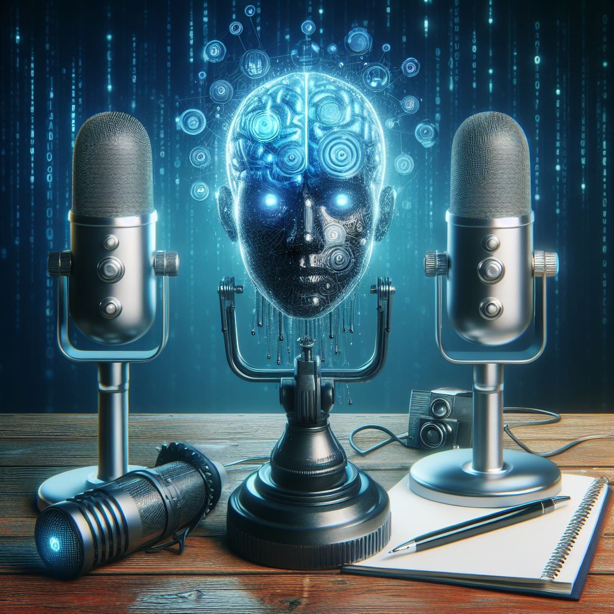

# Impacto de la inteligencia artificial y el machine learning

## Estos son los puntos más importantes del impacto de la IA en el sonido:

1. **Generación de sonido:**

    La IA se utiliza para generar y sintetizar nuevos sonidos, lo que es útil en la producción musical y en la creación de efectos de sonido para diversas aplicaciones, desde videojuegos hasta películas. 
    
2. **Reconocimiento de voz:**

    Las tecnologías de reconocimiento de voz permiten comandos de voz precisos y aplicaciones como asistentes virtuales, contribuyendo a la interacción natural con dispositivos de audio.

3. **Creación de música asistida por IA:**

    Se están desarrollando sistemas que utilizan IA para componer música, explorar nuevas ideas creativas y colaborar con compositores humanos.
    [Ejemplo](https://elpais.com/cultura/2023-11-08/bad-bunny-carga-contra-una-cancion-creada-con-ia-si-les-gusta-esa-mierda-no-merecen-ser-mis-amigos.html#)
